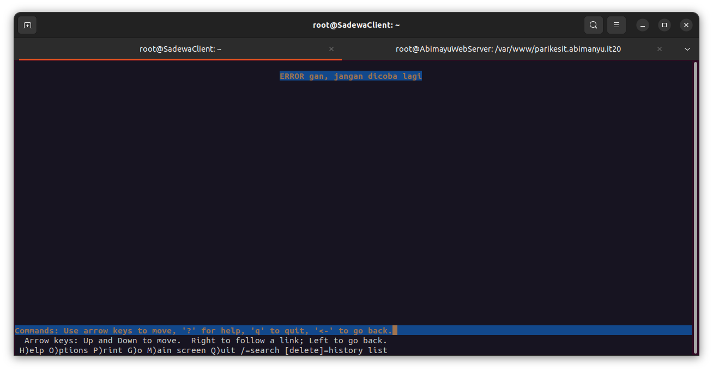
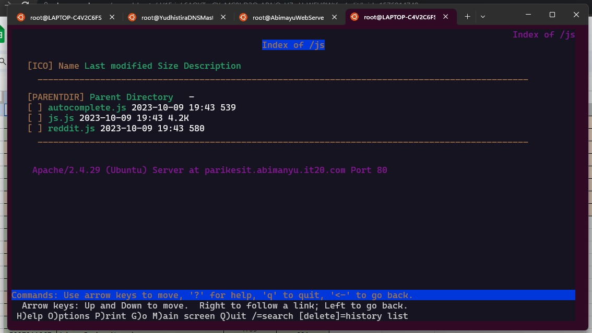
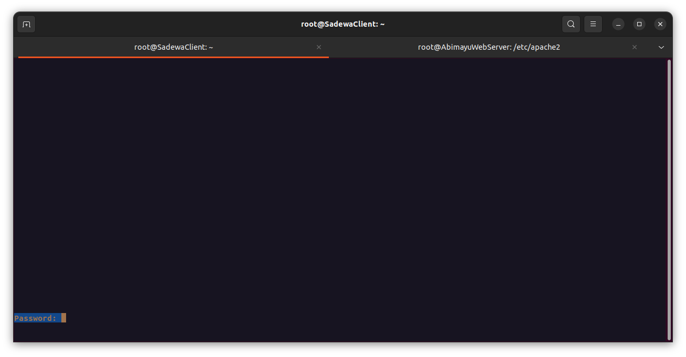
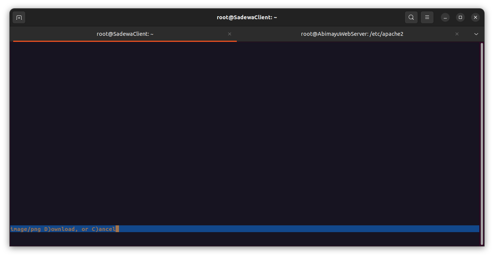

# Laporan Resmi Praktikum Jaringan Komputer - Modul 2 IT 20

### Annisa Rahmapuri - 5027211018

### Abdul Zaki Syahrul Rahmat - 502721120

## Soal 1

Yudhistira akan digunakan sebagai DNS Master, Werkudara sebagai DNS Slave, Arjuna merupakan Load Balancer yang terdiri dari beberapa Web Server yaitu Prabakusuma, Abimanyu, dan Wisanggeni. Buatlah topologi dengan pembagian [sebagai berikut.](https://docs.google.com/spreadsheets/d/1OqwQblR_mXurPI4gEGqUe7v0LSr1yJViGVEzpMEm2e8/edit?usp=sharing) Folder topologi dapat diakses pada [drive berikut](https://drive.google.com/drive/folders/1Ij9J1HdIW4yyPEoDqU1kAwTn_iIxg3gk?usp=sharing)

### Cara Pengerjaan

- Membuat konfirgurasi network pada setiap node sesuai dengan kerangka Topologi 02
    - Router Pandudewanata
        
        ```bash
        auto eth0
        iface eth0 inet dhcp
        
        auto eth1
        iface eth1 inet static
            address 192.243.1.1
            netmask 255.255.255.0
        
        auto eth2
        iface eth2 inet static
            address 192.243.2.1
            netmask 255.255.255.0
        
        auto eth3
        iface eth2 inet static
            address 192.243.3.1
            netmask 255.255.255.0
        ```
        
    - Yudhistira DNS Master
        
        ```bash
        auto eth0
        iface eth0 inet static
            address 192.243.3.2
            netmask 255.255.255.0
            gateway 192.243.3.1
        ```
        
    - Sadewa Client
        
        ```bash
        auto eth0
        iface eth0 inet static
            address 192.243.1.2
            netmask 255.255.255.0
            gateway 192.243.1.1
        ```
        
    - Nakula Client
        
        ```bash
        auto eth0
        iface eth0 inet static
            address 192.243.1.3
            netmask 255.255.255.0
            gateway 192.243.1.1
        ```
        
    - Werkudara DNS Slave
        
        ```bash
        auto eth0
        iface eth0 inet static
            address 192.243.2.2
            netmask 255.255.255.0
            gateway 192.243.2.1
        ```
        
    - Arjuna Load Balancer
        
        ```bash
        auto eth0
        iface eth0 inet static
            address 192.243.2.3
            netmask 255.255.255.0
            gateway 192.243.2.1
        ```
        
    - Abimanyu Web Server
        
        ```bash
        auto eth0
        iface eth0 inet static
            address 192.243.2.4
            netmask 255.255.255.0
            gateway 192.243.2.1
        ```
        
    - Prabukusuma Web Server
        
        ```bash
        auto eth0
        iface eth0 inet static
            address 192.243.2.5
            netmask 255.255.255.0
            gateway 192.243.2.1
        ```
        
    - Wisanggeni Web Server
        
        ```bash
        auto eth0
        iface eth0 inet static
            address 192.243.2.6
            netmask 255.255.255.0
            gateway 192.243.2.1
        
        ```
        
- Menjalankan command dibawah ini pada Router Pandudewanata
    
    ```bash
    iptables -t nat -A POSTROUTING -o eth0 -j MASQUERADE -s 192.243.0.0/16
    echo 'nameserver 192.168.122.1' > /etc/resolv.conf
    ```
    
- Menambahkan command dibawah ini pada seluruh node agar dapat terkoneksi internet
    
    ```bash
    echo 'nameserver 192.168.122.1' > /etc/resolv.conf
    ```
    

### Testing

Testing akses internet dengan contoh tujuan [google.com](http://google.com) pada seluruh node. 

```bash
ping google.com -c 5
```

### Output

Sadewa (Client) 

## Soal 2

Buatlah website utama pada node arjuna dengan akses ke **arjuna.it20.com** dengan alias **www.arjuna.it20.com**

### Cara Pengerjaan

- Yudhistira
    - Installasi bind9 dan dnsutils
        
        ```bash
        apt-get update
        apt-get install bind9 dnsutils -y
        ```
        
    - Menambahkan zona "arjuna.it20.com" ke /etc/bind/named.conf.local
        
        ```bash
        echo 'zone "arjuna.it20.com" {
                type master;
                file "/etc/bind/jarkom/arjuna.it20.com";
                allow-transfer { 192.243.2.3; };
        };' > /etc/bind9/named.conf.local
        ```
        
    - Membuat direktori untuk zona "arjuna.it20.com" dan menyalin berkas db.local ke /etc/bind/jarkom/arjuna.it20.com
        
        ```bash
        mkdir /etc/bind/jarkom
        
        cp /etc/bind/db.local /etc/bind/jarkom/arjuna.it20.com
        ```
        
    - Menambahkan konfigurasi untuk zona "arjuna.it20.com" ke berkas /etc/bind/jarkom/arjuna.it20.com
        
        ```bash
        echo '
        ;
        ; BIND data file for local loopback interface
        ;
        $TTL    604800
        @       IN      SOA     arjuna.it20.com. root.arjuna.it20.com. (
                                2023101001      ; Serial
                                 604800         ; Refresh
                                  86400         ; Retry
                                2419200         ; Expire
                                 604800 )       ; Negative Cache TTL
        ;
        @       IN      NS      arjuna.it20.com.  # Menetapkan nama server name server (NS)
        @       IN      A       192.243.3.2   ; # Menetapkan alamat IP Yudhistira
        www     IN      CNAME   arjuna.it20.com.' > /etc/bind/jarkom/arjuna.it20.com# Alias "www" yang mengarah ke "arjuna.it20.com"
        ```
        
    - Restart bind9
        
        ```bash
        service bind9 restart
        ```
        

### Testing

Arjuna

```bash
ping arjuna.it20.com -c 5
ping www.arjuna.it20.com -c 5
```

### Output

Arjuna 

## Soal 3

Dengan cara yang sama seperti soal nomor 2, buatlah website utama dengan akses ke **abimanyu.it20.com** dan alias **www.abimanyu.it20.com**.

### Cara Pengerjaan

- Yudhistira
    - Installasi bind9 dan dnsutils
        
        ```bash
        apt-get update
        apt-get install bind9 dnsutils -y
        ```
        
    - Menambahkan konfigurasi zona "abimanyu.it20.com" ke /etc/bind/named.conf.local
        
        ```bash
        echo 'zone "abimanyu.it20.com" {
                type master;              
                file "/etc/bind/jarkom/abimanyu.it20.com";  # Lokasi berkas zona
                allow-transfer { 192.243.2.4; }; // IP Abimanyu  # Mengizinkan transfer zona ke alamat IP tertentu (192.243.2.3)
        };' > /etc/bind/named.conf.local
        ```
        
    - Menyalin berkas db.local ke /etc/bind/jarkom/abimanyu.it20.com
        
        ```bash
        cp /etc/bind/db.local /etc/bind/jarkom/abimanyu.it20.com
        ```
        
    - Menambahkan konfigurasi untuk zona "abimanyu.it20.com" ke berkas /etc/bind/jarkom/abimanyu.it20.com
        
        ```bash
        echo '
        ;
        ; BIND data file for local loopback interface
        ;
        $TTL    604800
        @       IN      SOA     abimanyu.it20.com. root.abimanyu.it20.com. (
                                2023101001      ; Serial
                                 604800         ; Refresh
                                  86400         ; Retry
                                2419200         ; Expire
                                 604800 )       ; Negative Cache TTL
        ;
        @       IN      NS      abimanyu.it20.com.  # Menetapkan nama server name server (NS)
        @       IN      A       192.243.3.2     ; # Menetapkan alamat IP Yudhistira
        www     IN      CNAME   abimanyu.it20.com.'  # Alias "www" yang mengarah ke "abimanyu.it20.com"
        
        ```
        
    - Restart bind9
        
        ```bash
        service bind9 restart
        ```
        

### Testing

Abimanyu

```bash
ping abimanyu.it20.com -c 5
ping www.abimanyu.it20.com -c 5
```

### Output

Abimanyu

## Soal 4

Kemudian, karena terdapat beberapa web yang harus di-deploy, buatlah subdomain **parikesit.abimanyu.yyy.com** yang diatur DNS-nya di Yudhistira dan mengarah ke Abimanyu.

### Cara Pengerjaan

- Yudhistira →
    - Menambahkan subdomain parikesit → `parikesit IN    A       192.243.2.4     ; IP Abimanyu' > /etc/bind/jarkom/abimanyu.it20.com` saja pada DNS Master.
        
        ```bash
        
        echo ';
        ; BIND data file for local loopback interface
        ;
        $TTL    604800
        @       IN      SOA     abimanyu.it20.com. root.abimanyu.it20.com. (
                                2023101001      ; Serial
                                 604800         ; Refresh
                                  86400         ; Retry
                                2419200         ; Expire
                                 604800 )       ; Negative Cache TTL
        ;
        @       IN      NS      abimanyu.it20.com.  # Menetapkan nama server name server (NS)
        @       IN      A       192.243.3.2     ; # Menetapkan alamat IP Yudhistira
        www     IN      CNAME   abimanyu.it20.com.
        parikesit IN    A       192.243.2.4     ; IP Abimanyu' > /etc/bind/jarkom/abimanyu.it20.com 
        ```
        
    - Restart bind9
        
        ```bash
        service bind9 restart
        ```
        

### Testing

Abimanyu

```bash
ping parikesit.abimanyu.it20.com -c 5
```

### Output

Abimanyu

## Soal 5

Buat juga reverse domain untuk domain utama. (*Abimanyu saja yang direverse*)

### Cara Pengerjaan

- Yudhistira
    - Menambahkan konfigurasi zona reverse DNS
        
        ```bash
        echo 'zone "2.243.192.in-addr.arpa" {
            type master;
            file "/etc/bind/jarkom/2.243.192.in-addr.arpa";
        };' > /etc/bind/named.conf.local
        ```
        
    - Menambahkan konfigurasi untuk zona reverse DNS ke berkas /etc/bind/jarkom/2.243.192.in-addr.arpa
        
        ```bash
        echo 'zone "2.243.192.in-addr.arpa" {
            type master;  # Menentukan jenis zona (master)
            file "/etc/bind/jarkom/2.243.192.in-addr.arpa";  # Menentukan lokasi berkas zona reverse DNS
        };' > /etc/bind/named.conf.local
        ```
        
    - Menenetapkan PTR (Pointer) record untuk alamat IP Abimanyu "192.243.2.4"
        
        ```bash
        echo '
        ;
        ; BIND data file for local loopback interface
        ;
        $TTL    604800
        @       IN      SOA     abimanyu.it20.com. root.abimanyu.it20.com. (
                                      2         ; Serial
                                 604800         ; Refresh
                                  86400         ; Retry
                                2419200         ; Expire
                                 604800 )       ; Negative Cache TTL
        ;
        @       IN      NS      abimanyu.it20.com.  # Menetapkan nama server name server (NS)
        4       IN      PTR     abimanyu.it20.com.' > /etc/bind/jarkom/2.243.192.in-addr.arpa  # Menetapkan PTR (Pointer) record untuk alamat IP "192.243.2.4"
        
        ```
        
    - Restart bind9
        
        ```bash
        service bind9 restart
        ```
        

### Testing

Abimanyu

```bash
host -t PTR 192.243.2.4 
```

### Output

Abimanyu

## Soal 6

Agar dapat tetap dihubungi ketika DNS Server Yudhistira bermasalah, buat juga Werkudara sebagai DNS Slave untuk domain utama.

### Cara Pengerjaan

- Yudhistira
    - Menambah konfigurasi `also-notify` dan `allow-transfer` pada zona "[arjuna.it20.com](http://arjuna.it20.com/)" dan "[abimanyu.it20.com](http://abimanyu.it20.com/)" dalam named.conf.local
        
        ```bash
        echo '
        zone "arjuna.it20.com" {
            type master;
            notify yes;
            also-notify { 192.243.2.2; }; 
            allow-transfer { 192.243.2.2; }; 
            file "/etc/bind/jarkom/arjuna.IT20.com";
        
        };
        
        zone "abimanyu.it20.com" {
            type master;
            notify yes;
            also-notify { 192.243.2.2; }; // Masukan IP Werdukara tanpa tanda petik
            allow-transfer { 192.243.2.2; }; // Masukan IP Werdukara tanpa tanda petik
            file "/etc/bind/jarkom/abimanyu.IT20.com";
        
        }; ' > /etc/bind/named.conf.local
        ```
        
    - Restart dan stop bind9 untuk testing DNS Slave
        
        ```bash
        service bind9 restart
        service bind9 stop
        ```
        
- Werkudara
    - Installasi bind9 dan dnsutils
        
        ```bash
        apt-get update
        apt-get install bind9 dnsutils -y
        ```
        
    - Konfigurasi server DNS sebagai slave untuk zona "[arjuna.it20.com](http://arjuna.it20.com/)" dan "[abimanyu.it20.com](http://abimanyu.it20.com/)"
        
        ```bash
        echo '
        # DNS SLave
        zone "arjuna.it20.com" {
            type slave;
            masters { 192.243.3.2; }; // IP Yudhistira 
            file "/var/lib/bind/arjuna.IT20.com";
        
        }
        # DNS SLave
        zone "abimanyu.it20.com" {
            type slave;
            masters { 192.243.3.2; }; // Masukan IP Yudhistira
            file "/var/lib/bind/abimanyu.IT20.com";
        
        }; ' > /etc/bind/named.conf.local
        ```
        

### Testing

- Yudhitira
    
    ```bash
    service bind9 stop
    ```
    
- Abimanyu
    
    ```bash
    ping abimanyu.it20.com -c 5
    ping www.abimanyu.it20.com -c 5
    ```
    

### Output

- Yudhistira
    
    
- Abimanyu
    
    

## Soal 7

Seperti yang kita tahu karena banyak sekali informasi yang harus diterima, buatlah subdomain khusus untuk perang yaitu **baratayuda.abimanyu.it20.com** dengan alias **www.baratayuda.abimanyu.it20.com** yang didelegasikan dari Yudhistira ke Werkudara dengan IP menuju ke Abimanyu dalam folder Baratayuda.

### Cara Pengerjaan

- Yudhistira
    - Menambahkan konfigurasi `ns1     IN      A       192.243.2.2     ; IP Werkudara` pada /etc/bind/jarkom/abimanyu.it20.com
        
        ```bash
        echo ';
        ; BIND data file for local loopback interface
        ;
        $TTL    604800
        @       IN      SOA     abimanyu.it20.com. root.abimanyu.it20.com. (
                                2023101001      ; Serial
                                 604800         ; Refresh
                                  86400         ; Retry
                                2419200         ; Expire
                                 604800 )       ; Negative Cache TTL
        ;
        @       IN      NS      abimanyu.it20.com.
        @       IN      A       192.243.3.2     ; IP Yudhistira
        www     IN      CNAME   abimanyu.it20.com.
        parikesit IN    A       192.243.2.4     ; IP Abimanyu
        ns1     IN      A       192.243.2.2     ; IP Werkudara
        baratayuda IN   NS      ns1' > /etc/bind/jarkom/abimanyu.it20.com
        ```
        
    - Menambah konfigurasi  `allow-query { any; };` pada named.conf.options
        
        ```bash
        echo "options {
            directory \"/var/cache/bind\";
            //dnssec-validation auto;
        
            allow-query { any; };
            auth-nxdomain no;
            listen-on-v6 { any; };
        };" > /etc/bind/named.conf.options
        ```
        
    - Restart bind9
        
        ```bash
        
        service bind9 restart
        ```
        
- Werkudara
    - Menambahkan konfigurasi zona "[baratayuda.abimanyu.it20.com](http://baratayuda.abimanyu.it20.com/)" ke named.conf.local
        
        ```bash
        echo 'zone "baratayuda.abimanyu.it20.com" {
                type master;
                file "/etc/bind/baratayuda/baratayuda.abimanyu.it20.com";
        };' >> /etc/bind/named.conf.local
        ```
        
    - Membuat direktori /etc/bind/baratayuda dan menyalin berkas db.local ke /etc/bind/baratayuda/baratayuda.abimanyu.it20.com
        
        ```bash
        mkdir /etc/bind/baratayuda
        
        cp /etc/bind/db.local /etc/bind/baratayuda/baratayuda.abimanyu.it20.com
        ```
        
    - Menambahkan konfigurasi zona "[baratayuda.abimanyu.it20.com](http://baratayuda.abimanyu.it20.com/)" ke berkas /etc/bind/baratayuda/baratayuda.abimanyu.it20.com
        
        ```bash
        hh
        echo '
        ;
        ; BIND data file for local loopback interface
        ;
        $TTL    604800
        @       IN      SOA     baratayuda.abimanyu.it20.com. root.baratayuda.abimanyu.it20.com. (
                                2023101001      ; Serial
                                 604800         ; Refresh
                                  86400         ; Retry
                                2419200         ; Expire
                                 604800 )       ; Negative Cache TTL
        ;
        @       IN      NS      baratayuda.abimanyu.it20.com.
        @       IN      A       192.243.2.4     ; IP Abimanyu
        www     IN      CNAME   baratayuda.abimanyu.it20.com.' > /etc/bind/baratayuda/baratayuda.abimanyu.it20.com
        
        ```
        
    - Menambah konfigurasi  `allow-query { any; };` pada named.conf.options
        
        ```bash
        echo "options {
            directory \"/var/cache/bind\";
            //dnssec-validation auto;
        
            allow-query { any; };
            auth-nxdomain no;
            listen-on-v6 { any; };
        };" > /etc/bind/named.conf.options
        ```
        
    - Restart bind9
        
        ```bash
        service bind9 restart
        ```
        

### Testing

Sadewa 

```bash
ping baratayuda.abimanyu.it20.com -c 5
ping www.baratayuda.abimanyu.it20.com -c 5
```

### Output

Sadewa

## Soal 8

Untuk informasi yang lebih spesifik mengenai Ranjapan Baratayuda, buatlah subdomain melalui Werkudara dengan akses **rjp.baratayuda.abimanyu.it20.com** dengan alias **www.rjp.baratayuda.abimanyu.it20.com** yang mengarah ke Abimanyu.

### Cara Pengerjaan

- Yudhistira
    - MEnambahkan konfigurasi subdomain delegasi rjp pada /etc/bind/baratayuda/baratayuda.abimanyu.it20.com
        
        ```bash
        echo '
        ;
        ; BIND data file for local loopback interface
        ;
        $TTL    604800
        @       IN      SOA     baratayuda.abimanyu.it20.com. root.baratayuda.abimanyu.it20.com. (
                                2023101001      ; Serial
                                 604800         ; Refresh
                                  86400         ; Retry
                                2419200         ; Expire
                                 604800 )       ; Negative Cache TTL
        ;
        @       IN      NS      baratayuda.abimanyu.it20.com.
        @       IN      A       192.243.2.4     ; IP Abimanyu
        www     IN      CNAME   baratayuda.abimanyu.it20.com.
        rjp             IN      A       192.243.2.4     ; IP Abimanyu
        www.rjp         IN      CNAME   rjp.baratayuda.abimanyu.it20.com.' > /etc/bind/baratayuda/baratayuda.abimanyu.it20.com
        ```
        

### Testing

Sadewa  

```bash
ping rjp.baratayuda.abimanyu.it20.com -c 5
ping www.rjp.baratayuda.abimanyu.it20.com -c 5
```

### Output

Sadewa

## Soal 9 dan 10

Arjuna merupakan suatu Load Balancer Nginx dengan tiga worker (yang juga menggunakan nginx sebagai webserver) yaitu Prabakusuma, Abimanyu, dan Wisanggeni. Lakukan deployment pada masing-masing worker. Kemudian gunakan algoritma **Round Robin** untuk Load Balancer pada **Arjuna**. Gunakan *server_name* pada soal nomor 1. Untuk melakukan pengecekan akses alamat web tersebut kemudian pastikan worker yang digunakan untuk menangani permintaan akan berganti ganti secara acak. Untuk webserver di masing-masing worker wajib berjalan di port 8001-8003. Contoh

- *Prabakusuma:8001*
- *Abimanyu:8002*
- *Wisanggeni:8003*

### Cara Pengerjaan

- Web Server / Worker (Abimanyu, Werdukara, Prabukusuma)
    - Instalasi kebutuhan
        
        ```bash
        apt-get update
        apt-get install dnsutils -y
        apt-get install lynx -y
        apt-get install nginx -y
        apt-get install apache2 -y
        apt-get install libapache2-mod-php7.2 -y
        apt-get install wget -y
        apt-get install unzip -y
        apt-get install php -y
        apt-get install php-fpm -y
        ```
        
    - Menjalankan nginx
        
        ```bash
        service nginx start
        ```
        
    - Menambahkan template worker php ke /var/www/jarkom/index.php
        
        ```bash
        mkdir /var/www/jarkom
        
        echo "<?php
        \$hostname = gethostname();
        \$date = date('Y-m-d H:i:s');
        \$php_version = phpversion();
        \$username = get_current_user();
        
        echo \"Hello World!<br>\";
        echo \"Saya adalah: \$username<br>\";
        echo \"Saat ini berada di: \$hostname<br>\";
        echo \"Versi PHP yang saya gunakan: \$php_version<br>\";
        echo \"Tanggal saat ini: \$date<br>\";
        ?>" > /var/www/jarkom/index.php
        ```
        
    - Menambahkan konfigurasi masing masing worker pada /etc/nginx/sites-available/jarkom
        - *Prabakusuma:8001*
        - *Abimanyu:8002*
        - *Wisanggeni:8003*
        
        ```bash
        echo "
        server {
        
            listen 800X;
        
            root /var/www/jarkom;
        
            index index.php index.html index.htm;
            server_name _;
            
            location / {
                try_files \$uri \$uri/ /index.php?\$query_string;
            }
        
            # pass PHP scripts to FastCGI server
            location ~ \.php$ {
                include snippets/fastcgi-php.conf;
                fastcgi_pass unix:/var/run/php/php7.2-fpm.sock;
            }
        
            location ~ /\.ht {
             deny all;
            }
        
            error_log /var/log/nginx/jarkom_error.log;
            access_log /var/log/nginx/jarkom_access.log;
        }
        " > /etc/nginx/sites-available/jarkom
        ```
        
    - Menajalankan symlink
        
        ```bash
        ln -s /etc/nginx/sites-available/jarkom /etc/nginx/sites-enabled
        ```
        
    - Menghapus `default` pada nginx agar tidak terjadi konflik
        
        ```bash
        rm /etc/nginx/sites-enabled/default
        ```
        
    - Menjalankan nginx dan php
        
        ```bash
        service nginx restart
        
        service php7.2-fpm start
        service php7.2-fpm status
        ```
        
- Arjuna
    - Membuat Konfigurasi Load Balancing dengan Round Robin pada /etc/nginx/sites-available/jarkom
        
        ```bash
        echo 'upstream arjuna {
          server 192.243.2.5:8001; # IP PrabuKusuma
          server 192.243.2.4:8002; # IP Abimanyu
          server 192.243.2.6:8003; # IP Wisanggeni
        }
        
        server {
          listen 80;
          server_name arjuna.it20.com www.arjuna.it20.com;
        
          location / {
            proxy_pass http://arjuna;
          }
        }
        ' > /etc/nginx/sites-available/jarkom
        ```
        
    - Menajalankan symlink
        
        ```bash
        ln -s /etc/nginx/sites-available/jarkom /etc/nginx/sites-enabled
        ```
        
    - Menghapus `default` pada nginx agar tidak terjadi konflik
        
        ```bash
        rm /etc/nginx/sites-enabled/default
        ```
        
    - Menjalankan nginx
        
        ```bash
        service nginx restart
        ```
        

### Testing

Sadewa 

```bash
lynx http://192.243.2.4 
lynx http://192.243.2.5
lynx http://192.243.2.6
lynx http://arjuna.it20.com
```

### Output

Sadewa

## Nomor 11
**Soal** : Selain menggunakan Nginx, lakukan konfigurasi Apache Web Server pada worker Abimanyu dengan web server www.abimanyu.yyy.com. Pertama dibutuhkan web server dengan DocumentRoot pada /var/www/abimanyu.yyy

**Cara Pengerjaan** : 
Sebelum memulai untuk konfigurasi web server kita perlu melakukan instalasi Apache terlebih dahulu di node AbimanyuWebServer. Instalasi pada pengerjaan ini sudah ditambahkan ke dalam script .bashrc dalam bentuk shell script.

```
apt-get install apache2 -y
service apache2 start
```
Setelah itu kita akan lanjut untuk melakukan konfigurasi halaman yang akan digunakan. Pergi ke alamat /var/www/ lalu buat direktori baru bernama abimanyu.it20

```
cd /var/www/
mkdir abimanyu.it20
```

Untuk mengisi direktori tersebut dengan resource yang disediakan, gunakan wget dan unzip. Install unzip terlebih dahulu jika di node saat ini belum terinstall 

```
wget -O '/var/www/abimanyu.yyy.com.zip' 'https://drive.usercontent.google.com/download?id=1a4V23hwK9S7hQEDEcv9FL14UkkrHc-Zc'
unzip /var/www/abimanyu.yyy.com.zip -d /var/www/
mv /var/www/abimanyu.yyy.com /var/www/abimanyu.it20
rm /var/www/abimanyu.yyy.com.zip
```

Dari sini kita dapat melanjutkan untuk konfigurasi apachenya. Pergi ke folder /etc/apache2/sites-available kemudian copy file 000-default.conf sebagai basis file yang akan digunakan

```
cd /etc/apache2/sites-available
cp /etc/apache2/sites-available/000-default.conf /etc/apache2/sites-available/abimanyu.it20.conf
nano abimanyu.it20.conf
```
Langsung saja kita konfigurasikan file tersebut sebagai berikut

```
ServerAdmin webmaster@localhost
DocumentRoot /var/www/abimanyu.it20
ServerName abimanyu.it20.com
ServerAlias www.abimanyu.it20.com
```
Save file tersebut, kemudian jalankan command berikut untuk menjalankan situs Abimanyu
```
a2ensite abimanyu.it20.conf
service apache2 reload
```
Pergi ke node Sadewa atau client. Jalankan command lynx ke www.abimanyu.it20.com melalui port 8080, jika berhasil maka akan tampil halaman berikut
```
lynx www.abimanyu.it20.com:8080/
```


## Nomor 12
**Soal** : Setelah itu ubahlah agar url www.abimanyu.yyy.com/index.php/home menjadi www.abimanyu.yyy.com/home.

**Cara Pengerjaan** : Pada soal nomor 12 ini kita diperintahkan untuk melakukan Directory Rewrite dari /index.php/home menjadi /home. Disini kita akan menggunakan .htaccess maka sebelum itu kita perlu menyalakan modul rewrite
```
a2enmod rewrite
```
Setelah itu kita dapat langsung pergi ke folder web Abimanyu dan menambahkan file .htaccess di direktori tersebut
```
cd /var/www/abimanyu.it20
nano .htaccess
```
Untuk isi dari file .htaccess diisi dengan script berikut
```
RewriteEngine On
RewriteRule ^home$ /index.php/home [L]
```
Script ini digunakan untuk mengaktifkan RewriteEngine pada domain web server Abimanyu dan mengalihkan /index.php/home menjadi /home saja. Untuk testing dapat dilakukan kembali di node Sadewa
```
lynx www.abimanyu.it20.com:8080/home
```
Jika berhasil maka akan tampil halaman yang sama seperti sebelumnya


## Nomor 13
**Soal** : Selain itu, pada subdomain www.parikesit.abimanyu.yyy.com, DocumentRoot disimpan pada /var/www/parikesit.abimanyu.yyy

**Cara Pengerjaan** : Pada nomor 13 ini kita akan melakukan penambahan subdomain yaitu parikesit.abimanyu.it20.com. Lakukan step yang sama seperti nomor 11 sebelumnya yaitu membuat direktori pada /var/www/ dan mendownload resource yang diperlukan
```
cd /var/www/
mkdir parikesit.abimanyu.it20
```
```
wget -O '/var/www/parikesit.abimanyu.yyy.com.zip' 'https://drive.usercontent.google.com/download?id=1LdbYntiYVF_NVNgJis1GLCLPEGyIOreS'
unzip /var/www/parikesit.abimanyu.yyy.com.zip -d /var/www/
mv /var/www/parikesit.abimanyu.yyy.com /var/www/parikesit.abimanyu.it20
rm /var/www/parikesit.abimanyu.yyy.com.zip
mkdir /var/www/parikesit.abimanyu.it20/secret
mkdir /var/www/parikesit.abimanyu.it20/secret/html
```
Setelah itu kita dapat lanjut untuk menkonfigurasikan subdomain parikesit dengan mengikuti langkah-langkah pada nomor 11
```
cd /etc/apache2/sites-available
cp /etc/apache2/sites-available/000-default.conf /etc/apache2/sites-available/parikesit.abimanyu.it20.conf
nano parikesit.abimanyu.it20.conf
```
Untuk isi dari file konfigurasinya adalah sebagai berikut
```
ServerAdmin webmaster@localhost
DocumentRoot /var/www/parikesit.abimanyu.it20
ServerName parikesit.abimanyu.it20.com
ServerAlias www.parikesit.abimanyu.it20.com
```
Lakukan aktivasi untuk subdomain parikesit
```
a2ensite parikesit.abimanyu.it20.conf
service apache2 reload
```
Kembali lagi ke node Sadewa dan lakukan testing
```
lynx www.parikesit.abimanyu.it20.com:8080/
```
Jika berhasil akan tampil halaman berikut


## Nomor 14
**Soal** : Pada subdomain tersebut folder /public hanya dapat melakukan directory listing sedangkan pada folder /secret tidak dapat diakses (403 Forbidden).

**Cara Pengerjaan** : Di nomor ini kita diperintahkan untuk mengkonfigurasi Directory Listing untuk folder /public dan /secret. Kita hanya perlu mengubah konfigurasi dari subdomain parikesit. Tambahkan code berikut ke file .conf dari parikesit
```
cd /etc/apache2/sites-available
nano parikesit.abimanyu.it20.conf
```
```
<Directory /var/www/parikesit.abimanyu.it20/public>
    Options +Indexes
</Directory>

<Directory /var/www/parikesit.abimanyu.it20/secret>
    Options -Indexes
</Directory>
```
Save kemudian restart subdomain parikesit dengan perintah berikut
```
a2dissite parikesit.abimanyu.it20.conf
a2ensite parikesit.abimanyu.it20.conf
service apache2 reload
```
Kembali lagi ke node Sadewa atau client dan lakukanlah testing dengan command lynx sebagai berikut
```
lynx www.parikesit.abimanyu.it20.com:8080/public
lynx www.parikesit.abimanyu.it20.com:8080/secret
```
- Tampilan halaman /public


- Tampilan halaman /secret


## Nomor 15
**Soal** : Buatlah kustomisasi halaman error pada folder /error untuk mengganti error kode pada Apache. Error kode yang perlu diganti adalah 404 Not Found dan 403 Forbidden.

**Cara Pengerjaan** : Untuk menambahkan kustomisasi pada halaman eror kita dapat menambahkan konfigurasi pada file parikesit. Untuk codenya adalah seperti berikut

```
ErrorDocument 403 /error/403.html
ErrorDocument 404 /error/404.html
```
Kita hanya perlu menambahkan eror pada 404 dan 403 seperti yang diminta oleh soal. Jangan lupa untuk melakukan restart untuk parikesit dan service apache. Untuk melakukan testing eror 403 kita dapat mengakses folder /secret yang ada di soal sebelumnya dari node Sadewa
```
lynx www.parikesit.abimanyu.it20.com:8080/secret
```
Hasilnya adalah sebagai berikut


Untuk 404 kita akan coba menggunakan /jarkom yang dimana tidak exist pada parikesit
```
lynx www.parikesit.abimanyu.it20.com:8080/jarkom
```
Hasilnya seperti ini



## Nomor 16
**Soal** : Buatlah suatu konfigurasi virtual host agar file asset www.parikesit.abimanyu.yyy.com/public/js menjadi 
www.parikesit.abimanyu.yyy.com/js 

**Cara Pengerjaan** : Konfigurasi tersebut dapat dilakukan dengan menambahkan Directory Alias ke file config parikesit. Untuk script alias nya kurang lebih seperti ini

```
<Directory /var/www/parikesit.abimanyu.it20.com/public/js>
    Options +Indexes
</Directory>

Alias "/js" "/var/www/parikesit.abimanyu.it20.com/public/js"
```
Save kemudian restart subdomain parikesit. Testing dengan menggunakan
```
lynx www.parikesit.abimanyu.it20.com:8080/js
```
Untuk hasilnya seperti berikut



## Nomor 17
**Soal** : Agar aman, buatlah konfigurasi agar www.rjp.baratayuda.abimanyu.yyy.com hanya dapat diakses melalui port 14000 dan 14400.

**Cara Pengerjaan** : Sama seperti nomor-nomor sebelumnya, kita perlu membuat satu subdomain lagi yaitu subdomain rjp.baratayuda yang mana hanya dapat diakses melalui port 14000 dan 14400. Siapkan resourcenya terlebih dulu dengan cara yang sama
```
cd /var/www
mkdir rjp.baratayuda.abimanyu.it20
```
```
wget -O '/var/www/rjp.baratayuda.abimanyu.yyy.com.zip' 'https://drive.usercontent.google.com/download?id=1pPSP7yIR05JhSFG67RVzgkb-VcW9vQO6'
unzip /var/www/rjp.baratayuda.abimanyu.yyy.com.zip -d /var/www/
mv /var/www/rjp.baratayuda.abimanyu.yyy.com /var/www/rjp.baratayuda.abimanyu.it20
rm /var/www/rjp.baratayuda.abimanyu.yyy.com.zip
```
Setelah itu, kita dapat lanjut untuk melakukan penambahan subdomain nya
```
cd /etc/apache2/sites-available
cp /etc/apache2/sites-available/000-default.conf /etc/apache2/sites-available/rjp.baratayuda.abimanyu.it20.conf
nano baratayuda.abimanyu.it20.conf
```
Untuk config nya kita perlu merubah portnya menjadi 14000 dan 14400
```
cd /etc/apache2/sites-available
cp /etc/apache2/sites-available/000-default.conf /etc/apache2/sites-available/rjp.baratayuda.abimanyu.it20.conf
nano baratayuda.abimanyu.it20.conf
```
```
<VirtualHost *:14000 *:14400>
```
Sedangkan untuk domain nya kita lakukan seperti biasa
```
ServerAdmin webmaster@localhost
DocumentRoot /var/www/rjp.baratayuda.abimanyu.it20
ServerName rjp.baratayuda.abimanyu.it20.com
ServerAlias www.rjp.baratayuda.abimanyu.it20.com
```
Tambahkan rjp.baratayuda menggunakan a2ensite dan restart service apache
```
a2ensite abimanyu.it20.conf
service apache2 reload
```
Testing pada node Sadewa dengan command berikut
```
lynx www.rjp.baratayuda.abimanyu.it20.com:14400/
# atau
lynx www.rjp.baratayuda.abimanyu.it20.com:14000/
```
Jika hasilnya seperti ini maka sudah berhasil


Tetapi jika diakses melalui port selain dua diatas seperti 8000, hasilnya adalah error 


## Nomor 18
**Soal** : Untuk mengaksesnya buatlah autentikasi username berupa “Wayang” dan password “baratayudayyy” dengan yyy merupakan kode kelompok. Letakkan DocumentRoot pada /var/www/rjp.baratayuda.abimanyu.yyy.

**Cara Pengerjaan** : Nomor ini meminta kita untuk menambahkan sistem autentikasi simple untuk subdomain rjp.baratayuda, hal tersebut dapat kita lakukan dengan menggunakan library dari apache2 yaitu auth_basic dan authn_file. Kita akan enable kedua library terlebih dahulu

```
a2enmod auth_basic
a2enmod authn_file
service apache2 restart
```
Auth_basic adalah library dari apache2 yang menambahkan sistem autentikasi dengan menggunakan username dan password. Password biasanya disimpan dalam file bernama .htpasswd. Untuk membuat file .htpasswd dan meregister username dan password yang diminta kita dapat mengeksekusi command dibawah ini
```
echo "baratayudait20" | htpasswd -c -i /etc/apache2/.htpasswd Wayang
```
Command tersebut akan meregister user yang bernama 'Wayang' dengan password 'baratayudait20'. Untuk file konfigurasinya rjp.baratayuda juga perlu kita ubah dengan menambahkan script berikut
```
<Directory /var/www/rjp.baratayuda.abimanyu.it20>
                AuthType Basic
                AuthName "Folder Rahasia"
                AuthUserFile /etc/apache2/.htpasswd
                Require user Wayang
</Directory>
```
Script tersebut menambahkan sistem autentikasi di subdomain rjp.baratayuda dengan tipe basic dan file password yang berada di directory apache2. Untuk username yang diperbolehkan mengakses subdomain tersebut hanyalah user Wayang
```
a2dissite rjp.baratayuda.abimanyu.it20.conf
a2ensite rjp.baratayuda.abimanyu.it20.conf
service apache2 reload
```
```
lynx www.rjp.baratayuda.abimanyu.it20.com:14400/
# atau
lynx www.rjp.baratayuda.abimanyu.it20.com:14000/
```
Jika kita coba mengakses subdomain tersebut maka akan dimintai username terlebih dahulu

Jika username yang dimasukkan benar adalah Wayang, maka kita akan dimintai password

Tampilan selanjutnya jika username dan password benar adalah seperti dibawah ini


## Nomor 19
**Soal** : Buatlah agar setiap kali mengakses IP dari Abimanyu akan secara otomatis dialihkan ke www.abimanyu.yyy.com (alias)

**Cara Pengerjaan** : Pada poin 19 ini kita perlu untuk menambahkan alias IP Address pada file konfigurasi domain abimanyu. Untuk code yang perlu ditambahkan adalah sebagai berikut
```
ServerAlias 192.243.2.4
```
Jangan lupa untuk melakukan restart dsb
```
a2dissite abimanyu.it20.conf
a2ensite abimanyu.it20.conf
service apache2 reload
```
Untuk testingnya dapat digunakan command dibawah ini
```
lynx 192.243.2.4:8080/
```


## Nomor 20
**Soal** : Karena website www.parikesit.abimanyu.yyy.com semakin banyak pengunjung dan banyak gambar gambar random, maka ubahlah request gambar yang memiliki substring “abimanyu” akan diarahkan menuju abimanyu.png.

**Cara Pengerjaan** : Untuk memenuhi kondisi tersebut kita dapat menggunakan modul Rewrite dan .htaccess pada subdomain abimanyu, karena modul tersebut sudah diaktifkan di nomor-nomor sebelumnya, maka kita dapat langsung melakukan konfigurasi
```
<Directory /var/www/parikesit.abimanyu.it20>
        Options +FollowSymLinks -Multiviews
        AllowOverride All
</Directory>
```
Masukkan code tersebut ke file konfigurasi subdomain parikesit. Langkah selanjutnya adalah membuat file .htaccess di direktori www parikesit
```
cd /var/www/parikesit.abimanyu.it20
nano .htaccess
```
Untuk isi file nya kurang lebih seperti berikut
```
RewriteEngine On

RewriteCond %{REQUEST_URI} abimanyu
RewriteCond %{REQUEST_URI} \.(jpg|jpeg|png|gif)$
RewriteCond %{REQUEST_URI} !/public/images/abimanyu.png

RewriteRule ^(.*)$ /public/images/abimanyu.png [R=301,L]
```
File .htaccess tersebut kurang lebih adalah menyalakan Rewrite Engine dengan kondisi URL yang diakses mengandung kata abimanyu dan formatnya adalah jpg, jpeg, png, atau gif. Sedangkan untuk URL nya langsung mengakses ke abimanyu.png dijadikan pengecualian agar tidak terjadi infinite looping pada redirectnya. Kemudian jika kondisi tersebut terpenuhi maka aturan yang berlaku adalah mereka di redirect ke URL /public/images/abimanyu.png
```
a2dissite parikesit.abimanyu.it20.conf
a2ensite parikesit.abimanyu.it20.conf
service apache2 reload
```
```
lynx parikesit.abimanyu.it20.com:8080/public/images/abimanyu-student.png
# atau
lynx parikesit.abimanyu.it20.com:8080/public/images/not-abimanyu.png
```
Maka hasil dari testingnya mereka akan diredirect ke abimanyu.png




Sedangkan jika diakses secara langsung
```
lynx parikesit.abimanyu.it20.com:8080/public/images/abimanyu.png
```


Kasus lain jika yang diakses bukanlah image yang mengandung kata abimanyu
```
lynx parikesit.abimanyu.it20.com:8080/public/images/buddies.jpg
```


### Notes : Untuk Web Server Abimanyu disini kita menggunakan port 8080 untuk menghindari konflik dengan service nginx yang secara default menggunakan port 80
